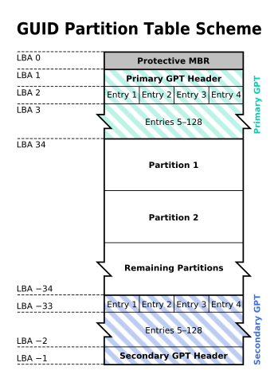
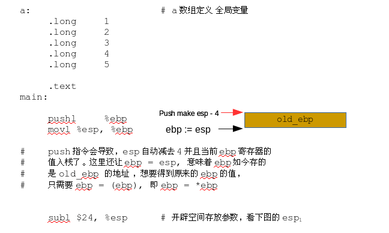

# GUID 分区表

GPT，[ GUID Partition Table](https://en.wikipedia.org/wiki/GUID_Partition_Table)  的缩写，是 EFI 引导盘所使用的分区方式，GUID 也称为 UUID，即全球唯一的标识符，是128位长度的数字相当于身份证，我们用16进制表示为32个数字组合，一般我们使用的是  **8-4-4-4-12** 的组合，例如  `123e4567-e89b-12d3-a456-426655440000` 就是一个 UUID，详细介绍请看 [Wiki](https://en.wikipedia.org/wiki/Universally_unique_identifier)

除此之外，我们还要了解一个叫 LBA，Logic Block Address \( 逻辑块 \)，的概念，如果有读者研究过文件系统的想必很容易理解，其实就是我们文件系统的所使用的逻辑块编号，早期我们的硬盘是 CHS 编址，LBA 则是这一层的抽象，把所有的扇区平铺在一起，就好像磁带一样，LBA 到 CHS 的转换很容易，不过一般是由驱动，或者硬件电路完成了可能也有文件系统支持，我这里没有详细了解，但是需要知道的一点就是， LBA 是为了解决 CHS 寻址太少的问题，也是随着大硬盘的出现，CHS 逐渐退出了舞台。

```bash
考虑 8 位的情况，假设 CHS 占位是 2:3:3，我们磁盘有6个磁头，每个盘面有3道，一道有6扇区
所以 一共有 6*3*6 = 108 块， 可是由于 CHS 固定编址，这里还是需要8位，而用 LBA 只需要7位
前面七位就可以编址 0~127 个块，所以我们说它有优势，而且不需要考虑 CHS 的位数分配
```


了解了 LBA 之后，我们现在可以说，在 GPT 中，LBA0 是受保护的，这句话就可以被理解了，就是第一块扇区，也就是说 MBR 是受保护的，是不使用的，因为 UEFI 中支持 MBR 引导，这是为了向后兼容，所以干脆 GPT 不使用这一块区域。



GPT 真正开始于第二块扇区，也就是 LBA1，同时磁盘的最后一部分还有备份，是为防止出错的情况，首先我们来关注它的组成。一个头部，然后带128个分区，也就是说我们分区可以高达128个，还是不算逻辑分区的情况，在以前MBR的时候，早期 Windows 只能有4个物理分区，也是由于 MBR 的限制，当然现在肯定不存在这个问题了。


上图是头部记录的一些关键信息，左-右 分别代表的是偏移量，长度和内容的解释。GPT 的头部记录了可用的逻辑块数量还有分区描述符的大小以及数量。也就是一些管理的信息，下面来看的关键的记录分区信息的结构，Partition Entry，怎么翻译我也不清楚，就叫分区描述符好了。


当一个程序读取了头部信息之后，就可以得到这个分区的数量，分区描述符大小以及开始的位置。于是它紧接着读每一个分区描述符，第一个字段就是标记分区类型的 GUID，比如这个分区如果是 ESP，也就是之前我们所说的，UEFI 引导的时候寻找的分区，它的 UUID/GUID 为  C12A7328-F81F-11D2-BA4B-00A 0C93EC93B ，千万别问我为什么是这一串数字，因为我也确实不清楚。也就是说，当发现一个分区的UUID 为这一串数字之后，也就找到了 ESP 分区，里面就有可以用来引导的文件，这下上一节留下的疑问也解答了。

紧接着，又是一个 UUID ，这是用来标记一个分区的，同样是 ESP 分区，在不同的硬盘，也就是不同的分区必然也会有不同的 UUID，这个是我们可以随意修改的，但是注意，在 Linux 下我们开机完成的自动挂载的分区，其实写在了 /etc/fstab ，如果你修改了 UUID ，记得把这里的也修改，因为这里也利用了第二个 UUID。


第一个 UUID 是用来标示不同分区类型 \( 不同功能 \) 的，而第二个 UUID 是用来标记不同的分区，具体可以 wiki 一下


如果我们想要检测分区信息，直接扫描头部发现分区数量，然后扫描每一个分区描述符，就马上可以得到，每一个分区所占的大小，分区名字以及它的属性。如果我们想要新建一个分区呢？首先你得找到空闲地方，也就是前面扫描所有的分区，接着根据得到的信息，便可以判断有多少连续的空间以及大小，在选择了大小之后，填写新的 Partition Entry ，填写名字\( 这步不是必须 \)以及占有的 LBA 的范围。

这里只是大概一个过程，我们需要知道的一点就是，Partition Entry 描述一块分区的信息，通过它我们可以知道分区的大小，以及位置，还有上面的属性字段，是用来描述这块分区的属性。



用位来表示属性非常常见了，这节省了大量空间，并且 与或 操作是 CPU 的强项，计算起来很迅速，所以是编程的时候很常用的手段。

上面都是死板的陈述，不太容易理解，下面我们来用 Linux 的命令来看看自己盘的一些信息。

```c
$ gdisk /dev/sda
    Command (? for help): p
    Disk /dev/sda: 1953525168 sectors, 931.5 GiB
    Logical sector size: 512 bytes
    Disk identifier (GUID): 5B027C98-904E-4B93-8C0E-B3F0DD46A830
    Partition table holds up to 128 entries
    First usable sector is 34, last usable sector is 1953525134
    Partitions will be aligned on 2048-sector boundaries
    Total free space is 174292333 sectors (83.1 GiB)

Number  Start (sector)    End (sector)  Size       Code  Name
   1            2048          411647   200.0 MiB   EF00  EFI System Partition
   2          411648         2508799   1024.0 MiB  0700  
   3         2508800       891308031   423.8 GiB   8E00  
   4       891308032      1422417919   253.3 GiB   0700  
   5      1527576576      1779234815   120.0 GiB   0700  
   6      1422417920      1527576575   50.1 GiB    0700  
    
```

输出可以发现，这其实就是读取了 GPT 的头部信息以及分区描述符，我相信每个人都可以写出这段代码，需要注意的一点，我的硬盘第5个分区其实在第6个分区之后，因为创建先后的问题，有段时间我在做硬盘的备份，所以出现了这种情况，不过并不影响我们查看。

```text
Command (? for help): i
Partition number (1-6): 1    # 查看 ESP 的信息
    Partition GUID code: C12A7328-F81F-11D2-BA4B-00A0C93EC93B (EFI System)
    Partition unique GUID: 6FCA7B42-3EDD-4559-B75B-B8EF45159130
    First sector: 2048 (at 1024.0 KiB)
    Last sector: 411647 (at 201.0 MiB)
    Partition size: 409600 sectors (200.0 MiB)
    Attribute flags: 0000000000000000
    Partition name: 'EFI System Partition'

```

上面的命令是查看 ESP 的分区，发现了吗，跟我们之前提及的 ESP 的 UUID 是一致的，就是这一确定的字段，所以我可以写代码也可以找到 ESP 分区。最后是关于的 ESP 的文件系统的问题，必须是 FAT32 或者 FAT16 这是协议里面规定的，所以确定的 UUID 和 确定的文件系统，在 UEFI 引导的时候就显得特别的简单，只需要支持 FAT文件系统 就好了，接着就能读取里面的文件，从而完成了操作系统引导这一 光荣使命。


部分的读者不习惯用命令行，其实 gdisk 有 UI 版本，叫 GParted 下载之后使用起来非常的方便，是一个很好用的管理软件。



