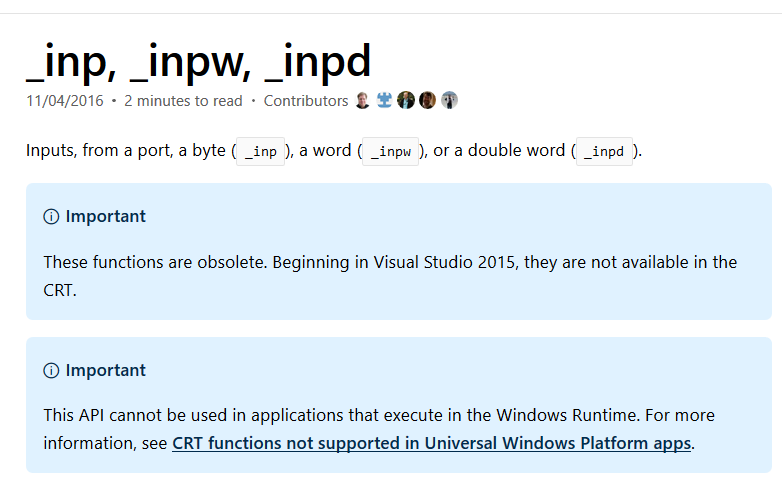

# GUID 分区表

GPT，[ GUID Partition Table](https://en.wikipedia.org/wiki/GUID_Partition_Table)  的缩写，是 EFI 引导盘所使用的分区方式，GUID 也称为 UUID，即全球唯一的标识符，是128位长度的数字相当于身份证，我们用16进制表示为32个数字组合，一般我们使用的是  **8-4-4-4-12** 的组合，例如  `123e4567-e89b-12d3-a456-426655440000` 就是一个 UUID，详细介绍请看 [Wiki](https://en.wikipedia.org/wiki/Universally_unique_identifier)

除此之外，我们还要了解一个叫 LBA，Logic Block Address \( 逻辑块 \)，的概念，如果有读者研究过文件系统的想必很容易理解，其实就是我们文件系统的所使用的逻辑块编号，早期我们的硬盘是 CHS 编址，LBA 则是这一层的抽象，把所有的扇区平铺在一起，就好像磁带一样，LBA 到 CHS 的转换很容易，不过一般是由驱动，或者硬件电路完成了可能也有文件系统支持，我这里没有详细了解，但是需要知道的一点就是， LBA 是为了解决 CHS 寻址太少的问题，也是随着大硬盘的出现，CHS 逐渐退出了舞台。

```bash
考虑 8 位的情况，假设 CHS 占位是 2:3:3，我们磁盘有6个磁头，每个盘面有3道，一道有6扇区
所以 一共有 6*3*6 = 108 块， 可是由于 CHS 固定编址，这里还是需要8位，而用 LBA 只需要7位
前面七位就可以编址 0~127 个块，所以我们说它有优势，而且不需要考虑 CHS 的位数分配
```



了解了 LBA 之后，我们现在可以说，在 GPT 中，LBA0 是受保护的，这句话就可以被理解了，就是第一块扇区，也就是说 MBR 是受保护的，是不使用的，因为 UEFI 中支持 MBR 引导，这是为了向后兼容，所以干脆 GPT 不使用这一块区域。


GPT 真正开始于第二块扇区，也就是 LBA1，同时磁盘的最后一部分还有备份，是为防止出错的情况，首先我们来关注它的组成。一个头部，然后带128个分区，也就是说我们分区可以高达128个，还是不算逻辑分区的情况，在以前MBR的时候，早期 Windows 只能有4个物理分区，也是由于 MBR 的限制，当然现在肯定不存在这个问题了。


上图是头部记录的一些关键信息，左-右 分别代表的是偏移量，长度和内容的解释。GPT 的头部记录了可用的逻辑块数量还有分区描述符的大小以及数量。也就是一些管理的信息，下面来看的关键的记录分区信息的结构，Partition Entry，怎么翻译我也不清楚，就叫分区描述符好了。


当一个程序读取了头部信息之后，就可以得到这个分区的数量，分区描述符大小以及开始的位置。于是它紧接着读每一个分区描述符，第一个字段就是标记分区类型的 GUID，比如这个分区如果是 ESP，也就是之前我们所说的，UEFI 引导的时候寻找的分区，它的 UUID/GUID 为  C12A7328-F81F-11D2-BA4B-00A 0C93EC93B ，千万别问我为什么是这一串数字，因为我也确实不清楚。也就是说，当发现一个分区的UUID 为这一串数字之后，也就找到了 ESP 分区，里面就有可以用来引导的文件，这下上一节留下的疑问也解答了。

紧接着，又是一个 UUID ，这是用来标记一个分区的，同样是 ESP 分区，在不同的硬盘，也就是不同的分区必然也会有不同的 UUID，这个是我们可以随意修改的，但是注意，在 Linux 下我们开机完成的自动挂载的分区，其实写在了 /etc/fstab ，如果你修改了 UUID ，记得把这里的也修改，因为这里也利用了第二个 UUID。


第一个 UUID 是用来标示不同分区类型 \( 不同功能 \) 的，而第二个 UUID 是用来标记不同的分区，具体可以 wiki 一下



