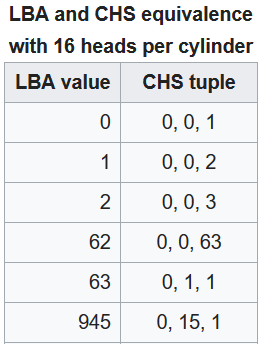

# 最近在玩WinIo遇到的问题

## o\(\*▽\*\)o

WinIo 库是能让用户直接访问物理地址的一个库，当然这里所说的物理地址是经过页映射之后得到的地址，并不是真正意义上的物理地址，参考之前一篇文章----地址空间。

WinIo 代码似乎并不复杂，当然我也在探索中，作为是 Windows 底层编写的一个入门。我想要是来实现键盘输入的模拟，其实就是类似驱动精灵的东西。在这里介绍一下遇到的问题，以及解决的途径。

首先，WinIo 是由 WinIo64.dll 以及 一个 WinIo64.sys 构成， 这里我假设都是64位机器，因为已经没有32位机器了吧，但是在网上的教程都是32位，所以还是有不少问题的。

使用起来很简单，WinIo64.dll 提供了一些接口。

```c
  WINIO_API bool _stdcall InitializeWinIo();
  WINIO_API void _stdcall ShutdownWinIo();
  WINIO_API PBYTE _stdcall MapPhysToLin(tagPhysStruct &PhysStruct);
  WINIO_API bool _stdcall UnmapPhysicalMemory(tagPhysStruct &PhysStruct);
  WINIO_API bool _stdcall GetPhysLong(PBYTE pbPhysAddr, PDWORD pdwPhysVal);
  WINIO_API bool _stdcall SetPhysLong(PBYTE pbPhysAddr, DWORD dwPhysVal);
  WINIO_API bool _stdcall GetPortVal(WORD wPortAddr, PDWORD pdwPortVal, BYTE bSize);
  WINIO_API bool _stdcall SetPortVal(WORD wPortAddr, DWORD dwPortVal, BYTE bSize);
  WINIO_API bool _stdcall InstallWinIoDriver(PWSTR pszWinIoDriverPath, bool IsDemandLoaded = false);
  WINIO_API bool _stdcall RemoveWinIoDriver();
```

忽略那些不认识的宏，关键使用的函数就这几个，

| Function | Description |
| :--- | :--- |
| InitializeWinIo | 初始化 |
| G/SetPhysLong | 读写物理内存单元 |
| ShutdownWinIo | 关闭，卸载驱动 |

其他映射函数，其实不用，估计是用来实现linux下 mmap 功能的，不过我还有点好奇，Windows下有没有 mmap 接口，没了解过。还有两个是驱动有关的，看函数名就知道意思。

那么，我们使用的时候，就是调用 initializeWinIo 函数，接着就可以直接读写物理内存单元了，是不是很霸道，因为这个库有一个对应的驱动，而驱动其实就是内核的代码，相当于你直接给内核发信息，自然是无所不能，大多数病毒，原型也是如此，利用的就是无限制的内存访问。

代码如何导入 dll 就不简述了，太多方案，我就以 java 使用 JNA 为例子，虽然深爱C，但是windows 的 C 对大多数东西的支持都太少了，用起来还麻烦，而且java有很多包，在想怎么简单就怎么简单的工程中，java绝对是不二之选了。

## 无法初始化的原因

网上有很多例子，也基本上都是 java 的，但是有些人却总是无法初始化，具体无法初始化的原因大致就是两个。

1. 程序没有运行在管理员权限，初始化函数做的重要的一件事就是加载驱动，如果程序没有管理员权限的话，是不能实现操作，那么初始化函数就会返回false。
2. 驱动没有被正确的加载，这里的原因就多啦，比如无法找到驱动，路径设置的问题，或者因为驱动没有签名，所以内核拒绝载入。

权限的问题很好解决，如果是IDE测试，那么就管理员权限启动 IDE 就可以解决，对于驱动的原因，签名的话，进入测试模式，给驱动打上签名就可以解决，测试模式的进入去看其他地方吧，签名的话右键sys文件，就可以看见。

大部分人做了以上两件事，最终得到的还是不能初始化，其实就是路径的问题，很多人说的是 .dll 和 .sys 必须要在同一个目录下，这其实不全对，其实是取决于 dll 加载的方式。

我们先看看， dll 是怎么获取到驱动的路径的。

```cpp
bool GetDriverPath() //WINIO 源码
{
    PWSTR pszSlash;

    if ( !GetModuleFileNameW( (HINSTANCE)(GetModuleHandle(NULL)),
                            szWinIoDriverPath,
                            sizeof(szWinIoDriverPath) )  )
        return false;
    pszSlash = wcsrchr(szWinIoDriverPath, '\\');

    if (pszSlash)
        pszSlash[1] = 0;
    else
        return false;

    if (g_Is64BitOS)  // 全局变量，判断是否为64bit
        wcscat(szWinIoDriverPath, L"winio64.sys");
    else
        wcscat(szWinIoDriverPath, L"winio32.sys");

    wprintf(L"%s\n", szWinIoDriverPath);

    return true;
}
```

```cpp
GetModuleHandle   获取处理该模块的模块的句柄，如果为NULL，则返回当前的模块的一个
句柄，简单就是说，当前程序的一个句柄

GetModuleFileNameW 获取模块的所在路径，上面运行之后可以得到运行程序的路径

wcsrchr(szWinIoDriverPath, '\\')  找到 \ 最后出现的位置，并返回一个指针

pszSlash[1] = 0; 其实把字符串截断了，最后 wcscat 其实就是在后面加上驱动名字
```

该写一个程序，跑一次就明白了

```cpp
#include <wchar.h>
#include <windows.h>
#include <winioctl.h>
#include <stdio.h>
wchar_t szWinIoDriverPath[32768];
void printPath()
{
    PWSTR pszSlash;
    if ( !GetModuleFileNameW( (HINSTANCE)(GetModuleHandle(NULL)),
                            szWinIoDriverPath,
                            sizeof(szWinIoDriverPath) )  ) {
        puts("error at GetModuleFileName");
        return;
    }
    pszSlash = wcsrchr(szWinIoDriverPath, '\\');
    wprintf(L"%s\n", szWinIoDriverPath);

    if (pszSlash)
        pszSlash[1] = 0;

        wcscat(szWinIoDriverPath, L"winio64.sys");

    wprintf(L"%s\n", szWinIoDriverPath);
}
写个 main 程序 跑一遍 得到输出

C:\Users\trance\eclipse-workspace\testdll\Debug\testdll.exe
C:\Users\trance\eclipse-workspace\testdll\Debug\winio64.sys
```

也就是说，其实这个 Dll 默认了一件事，驱动就在我当前的目录下，我只需要改写就能得到，但是我们IDE在调试的时候，是会建立一个 Debug 目录的，如果我们放在 /project/src 下，就会寻找不到驱动从而出错，实际上IDE运行的是Debug目录下的一个exe，那么我们把驱动放在那个目录下是否可行了呢？

当然没有这么简单，思考一下，如果我们是用C/C++或者是C\#等代码，自己的代码主动加载dll，那么得到的路径就是在工程（debug目录也算是），但是我们如果使用的是java，借用的是JNA的话，那么就有点不同了。

JNA的机制细节我并不熟悉，但是我们可以测试，把上面的代码编写成一个dll，下面是java的代码测试。

```java
import com.sun.jna.Library;
import com.sun.jna.Native;


public class Test {

    public interface WinIo extends Library {
        @SuppressWarnings("deprecation")
        WinIo Instance = ( WinIo )Native.loadLibrary("testdll", WinIo.class);        
        void printPath();
    }

    public static void main(String [] arg) {
        WinIo.Instance.printPath();
    }
}
```

注意 dll的名字为 testdll.dll， 然后放在 src 目录下，即和 package 目录同级


得到输出：

```text
C:\Program Files\Java\jre1.8.0_181\bin\winio64.sys
```

所以 JNA 加载的之后获取的路径，是 java 所在的路径，所以用java JNA包的朋友，应该把驱动放在java所在的路径之下，即可正常初始化。但是这样很奇怪，应该有解决方案，比如重新改写函数，传入驱动的路径。


注意 jdk 和 dll 必须是同样的位数，不然会报错，JNA 的一个坑就在于这里。我的机器 mingw 就是32位 还是请朋友用 MSVC 帮忙编译的。


## 匪夷所思的情况

上面解释了不能初始化的原因，但是有些人可能会发现，有时候可以初始化，有时候不可以，其实都能解释，初始化的时候，其实分为了几个步骤。

1. 判断为64/32位机器，设置相关变量
2. 判断驱动是否已经加载，如果加载调到第4步
3. 这里是驱动还没加载的情况，获取驱动路径，加载驱动。
4. 返回 true，设置相关变量

有时候我们使用比如，WinIo 自带了几个实例程序，它们实际上会安装驱动，如果那个程序没有调用 ShutdownWinIo ，驱动仍然加载在内存中，那么之后我们调用初始化函数，实际上不会执行到第三步，那么就一定会返回true，所以我们仍然算初始化成功。

在之前，我用C++写的初始化程序初始化成功之后，发现java的程序也可以初始化了，其实原因就在这里，但是如果重新开机，也就当驱动没有加载之前，直接使用java调用动态库初始化函数，是不会成功的，因为驱动的路径不对。

现在把驱动移动在java的/bin目录下，运行初始化程序，看是否成功。

```java
public interface WinIo extends Library {
        @SuppressWarnings("deprecation")
        WinIo Instance = ( WinIo )Native.loadLibrary("WinIo64", WinIo.class);        
        boolean ShutdownWinIo();
        boolean InitializeWinIo();
    }

    public static void main(String [] arg) {
        if( WinIo.Instance.InitializeWinIo()) {
            System.out.println("success");
        }
    }
```


上面可以看见，存在了一个 winio64 的驱动，路径也就是 java之下，在我们没有调用 ShutdownWinIo 或者关机之前，驱动都会存在于内存中，如果我们把驱动的源文件移除，然后调用函数，仍然可以成功，因为驱动没有被卸载。

```java
    public static void main(String [] arg) {
        if( WinIo.Instance.ShutdownWinIo() ) {
            System.out.println("success");
        }
    }
```

修改代码，移除驱动。


已经找不到了驱动了，如果此时我们把驱动文件移除，或者更换名字，初始化就会失败。


修改相关代码

```java
public static void main(String [] arg) {
    if( WinIo.Instance.InitializeWinIo() ) {
        System.out.println("success");
    } else {
        System.out.println("fail");
    }
}

output：
    fail

如果把驱动名字还原

output：
    success
读者可以在这之后不要调用 ShutdWinIo，并且把名字再次修改为 WinIo63.sys，这次
还是输出 Success 因为驱动还在内存中。
```

现在，已经非常清晰啦！

## 一些备注

在Visual C++.NET的所有编程方式中，BSTR、LPSTR以及LPWSTR这样的一些基本字符串类型是什么意思呢？

BSTR\(Basic STRing\)是一个OLECHAR\*类型的Unicode字符串。BSTR实际上就是一个COM字符串，但它却在自动化技术以外的多种场合下得到广泛使用。其中DWORD值是字符串中实际所占用的字节数，且它的值是字符串中Unicode字符的两倍。

LPSTR和LPWSTR是Win32和VC++所使用的一种字符串数据类型。LPSTR被定义成是一个指向以NULL\(‘/0’\)结尾的8位ANSI字符数组指针，而LPWSTR是一个指向以NULL结尾的16位双字节字符数组指针





有意思的是，64位并不需要这些函数，即使注释掉也没有任何问题。还有就是 Mingw 和 MSVC 在动态库的规范问题，这里不列出了。

